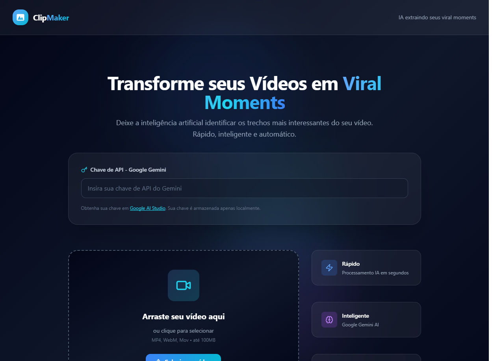
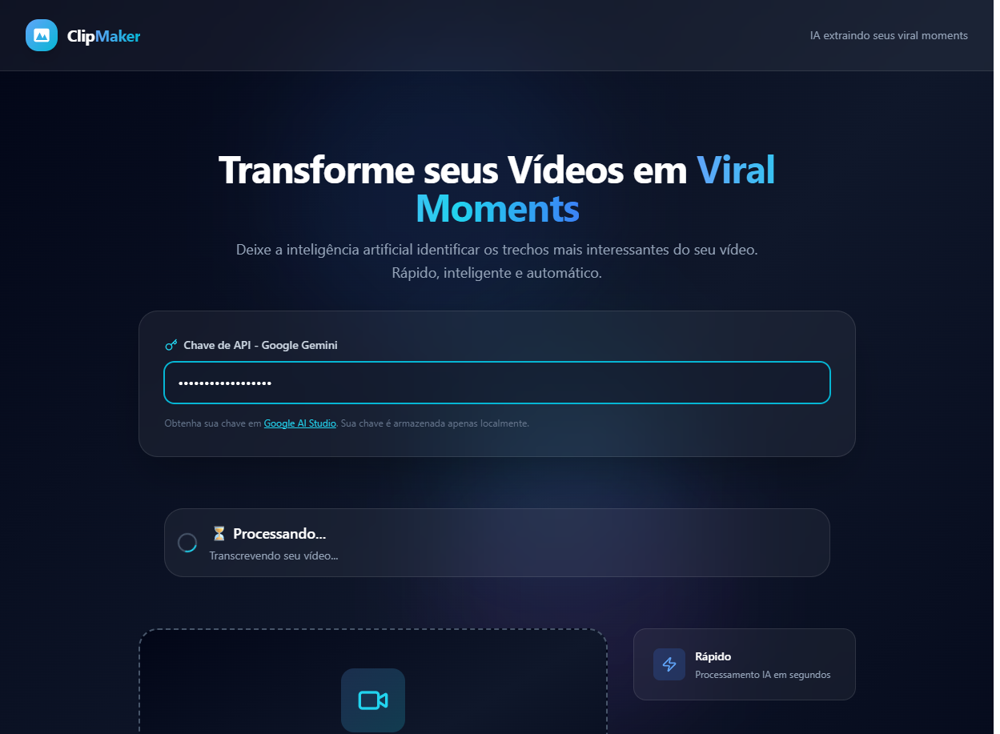
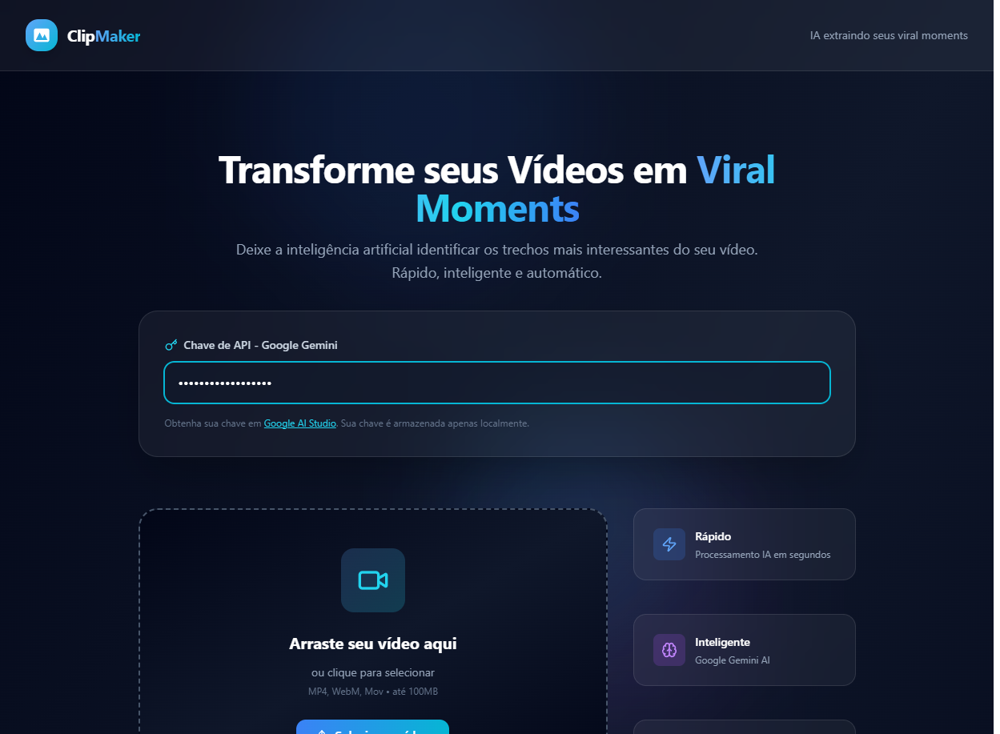

# ClipMaker - Transforme seus Vídeos em Viral Moments

<p align="center">
  
  
  
  
</p>

## 📋 Descrição

O **ClipMaker** é uma aplicação web inovadora que utiliza inteligência artificial para identificar e extrair automaticamente os momentos mais interessantes dos seus vídeos. Usando a API do Google Gemini, a ferramenta analisa a transcrição do áudio e detecta trechos engraçados, surpreendentes ou engajadores para criar clips curtos prontos para viralização.

## 🚀 Demonstração

A aplicação possui uma interface moderna com design glassmorphism, animações GSAP fluidas e suporte a tema escuro.

### Screenshots da Aplicação


*Interface principal com campo para API Key e área de upload*


*Status em tempo real durante transcrição e análise*


*Vídeo processado com opção de download*

## ✨ Funcionalidades

- **Upload de Vídeo**: Interface drag-and-drop com widget Cloudinary
- **Transcrição Automática**: Cloudinary processa o áudio e gera legendas
- **Análise por IA**: Google Gemini identifica o momento mais viral
- **Corte Inteligente**: Vídeo cortado automaticamente no momento selecionado
- **Download Rápido**: Baixe o clip processado diretamente

## 🛠️ Tecnologias

### Frontend
- **HTML5** - Estrutura semântica
- **Tailwind CSS v4** - Estilização via CDN
- **Vanilla JavaScript** - Lógica ES6+
- **GSAP 3.12** - Animações suaves
- **Lucide Icons** - Ícones vetoriais
- **Cloudinary Widget** - Upload de vídeos

### Backend
- **Node.js** - Runtime JavaScript
- **Express.js 5.2** - Framework web
- **Google Generative AI SDK** - Integração com Gemini
- **CORS** - Cross-origin resource sharing

### APIs Externas
- **Google Generative AI (Gemini)** - Análise de transcrição
- **Cloudinary** - Upload, transcrição e processamento de vídeo

## 📁 Estrutura do Projeto

```
clipmaker/
├── backend/
│   ├── src/
│   │   ├── server.js                    # Servidor Express principal
│   │   ├── routes/
│   │   │   ├── index.js                  # Router principal
│   │   │   └── GeminiWidgetRoute.js      # Rotas do Gemini Widget
│   │   └── controller/
│   │       └── GeminiWidgetController.js # Lógica de processamento IA
│   ├── package.json
│   └── .env                             # Variáveis de ambiente
│
├── frontend/
│   └── src/
│       ├── index.html                   # Página principal
│       ├── styles/
│       │   ├── index.css                # Design system e variáveis
│       │   └── components.css           # Componentes UI
│       └── scripts/
│           ├── index.js                 # Controller principal
│           ├── sendGemini.js            # Comunicação com backend
│           ├── waitForTranscription.js  # Aguarda transcrição Cloudinary
│           └── gsap-utils.js            # Utilitários de animação
│
├── screenshots/                          # Screenshots da aplicação
├── README.md                            # Este arquivo
└── DESIGN_SYSTEM.md                     # Documentação de design
```

## ⚡ Quick Start

### Pré-requisitos
- Node.js 18+
- Navegador moderno (Chrome 90+, Firefox 88+, Safari 14+)
- Conta Google Generative AI (para chave de API)
- Conta Cloudinary (para upload de vídeos)

### 1. Clone e Instalação

```bash
# Clone o repositório
git clone https://github.com/M-Fragata/Clipmaker.git
cd Clipmaker

# Instale dependências do backend
cd backend
npm install

# Crie arquivo .env
echo "GEMINI_KEY=sua_chave_aqui" > .env
echo "PORT=3333" >> .env
```

### 2. Inicie o Backend

```bash
cd backend
npm run dev
```

O servidor estará disponível em `http://localhost:3333`

### 3. Inicie o Frontend

```bash
# Use um servidor local (recomendado)
npx http-server frontend/src/

# Ou abra diretamente o arquivo HTML
# frontend/src/index.html
```

Acesse `http://localhost:8080` (ou a porta disponibilizada pelo http-server)

## 🔑 Configuração

### Google Gemini API
1. Acesse [Google AI Studio](https://aistudio.google.com/app/apikeys)
2. Crie uma nova chave de API
3. Cole no campo de entrada no ClipMaker
4. A chave é armazenada apenas no seu navegador (localStorage)

### Cloudinary
A aplicação já vem configurada com uma conta padrão. Para usar sua própria:

1. Acesse [Cloudinary Console](https://cloudinary.com/console)
2. Copie seu **Cloud Name**
3. Crie um **Upload Preset** público
4. Atualize em `frontend/src/scripts/index.js`:
```javascript
const cloudName = "seu_cloud_name"
const uploadPreset = "sua_preset"
```

## 🔄 Fluxo de Funcionamento

```
┌─────────────┐     ┌─────────────┐     ┌──────────────┐
│  Upload     │────▶│ Transcrição │────▶│ Análise IA   │
│  Vídeo      │     │  Cloudinary │     │   Gemini     │
└─────────────┘     └─────────────┘     └──────────────┘
                                                 │
                                                 ▼
                    ┌─────────────┐     ┌──────────────┐
                    │   Download   │◀────│ Corte Vídeo  │
│   Resultado      │    Clip      │     │  Cloudinary  │
                    └─────────────┘     └──────────────┘
```

1. **Upload**: Usuário carrega vídeo via widget Cloudinary
2. **Transcrição**: Cloudinary processa o áudio e gera transcrição
3. **Análise**: Backend envia transcrição para Google Gemini
4. **Corte**: Cloudinary corta o vídeo no momento identificado
5. **Resultado**: Vídeo processado é exibido para download

## 📊 Performance

| Métrica | Alvo | Status |
|---------|------|--------|
| FCP (First Contentful Paint) | < 1.5s | ✅ ~800ms |
| LCP (Largest Contentful Paint) | < 2.5s | ✅ ~1.2s |
| CLS (Cumulative Layout Shift) | < 0.1 | ✅ ~0.05 |
| Total JavaScript | < 150KB | ✅ ~90KB |

## 🔒 Segurança

- ✅ API Key armazenada apenas localmente (localStorage)
- ✅ Sem cookies ou rastreamento
- ✅ Dados não são salvos nos servidores
- ✅ HTTPS recomendado para produção

## 🎨 Design System

O projeto segue um design system premium com:

- **Glassmorphism**: Elementos translúcidos com desfoque
- **Animações GSAP**: Transições suaves e interativas
- **Escala 8pt**: Espaçamento padronizado
- **Responsividade**: Suporte mobile-first

Consulte [DESIGN_SYSTEM.md](./DESIGN_SYSTEM.md) para detalhes completos.

## 🤝 Contribuição

Para melhorias no projeto:

1. Edite `DESIGN_SYSTEM.md` para mudanças de arquitetura
2. Mantenha a escala 8pt em todos os espaçamentos
3. Adicione animações via GSAP, não CSS puro
4. Use classes Tailwind, não CSS customizado desnecessário

## 📝 Licença

ISC License - Veja o arquivo LICENSE para detalhes.
